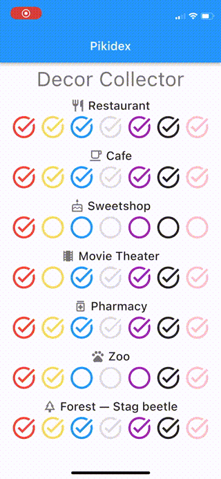
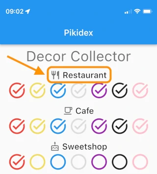
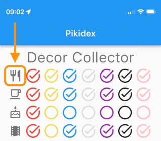

# Pikidex

This is small, fan built, application.
It allows you to track and share the progress of pikimin collection in Pikmin Bloom game.

All progress is saved only on your device.

Download:
- [App Store](https://apple.co/3onJKuy),
- [Google Play](https://bit.ly/3utNQW4).

## How to use application

Tap on icon, it will change its state:
- none,
- in progress (got pikmin and levelling friendship),
- done (got four hearts of friendship).

## Tips and tricks

1. Tap on group header (for example, Restaurant) to make it compact. 
2. Double tap group header to collapse all groups. This will switch all your collection to the compact mode.
3. In compact mode: tap on icon of the group (first in a row) to expand this group. 
4. Double tap icon of the group to expand all groups. This will switch all your collection to the regular mode.

## Roadmap

Here you can find features which we want to add to app in the (near) future:
- the number of pikmin with each color and/or decor,
- new icons,
- track alphabet letters.

## Contact
If you find an inaccuracy, or you have any suggestions, kindly feel free to [send us a word](mailto:pikidex@find-friends-team.ru).

## Privacy Policy
_Last updated: January 29th, 2022_

We (developers and publishers)
are providing this Privacy Policy
to explain our practices regarding the collection and use of information within the app Pikidex.

### COLLECTION AND USE OF INFORMATION

Pikidex does not collect any personally identifiable information.

Pikidex uses third-party service ([Google AdMob](https://policies.google.com/technologies/partner-sites))
to track app usage data and serve ads. 
Please review the privacy policy of this third party service for more information
regarding how they handle personal data.

### REVISIONS TO THIS PRIVACY POLICY

We may update our Privacy Policy from time to time. 
You are advised to review this page periodically for any changes.
These changes are effective immediately upon posting on this page.

---
Disclaimer: Pikmin Bloom game, its images and other resources belong to Niantic, Nintendo and other legal owners.